# Procesverslag
Markdown is een simpele manier om HTML te schrijven.  
Markdown cheat cheet: [Hulp bij het schrijven van Markdown](https://github.com/adam-p/markdown-here/wiki/Markdown-Cheatsheet).

Nb. De standaardstructuur en de spartaanse opmaak van de README.md zijn helemaal prima. Het gaat om de inhoud van je procesverslag. Besteedt de tijd voor pracht en praal aan je website.

Nb. Door *open* toe te voegen aan een *details* element kun je deze standaard open zetten. Fijn om dat steeds voor de relevante stuk(ken) te doen.

## Jij

  
uitwerken voor kick-off werkgroep

  ### Auteur:
  Kanokphon Sophaphon

  #### Je startniveau:
  blauw

  #### Je focus:
  surface plane
 

## Je website

  
uitwerken voor kick-off werkgroep

  ### Je opdracht:
  link naar de website <a>https://www.nolten.nl/<a> 

  #### Screenshot(s) van de eerste pagina (small screen): 
  pumps <a>https://www.nolten.nl/dames/schoenen/pumps/?p=1&properties=ba5ddb43c819f8b227a6eb6a88674c1f%7C92cc227532d17e56e07902b254dfad10<a>  
  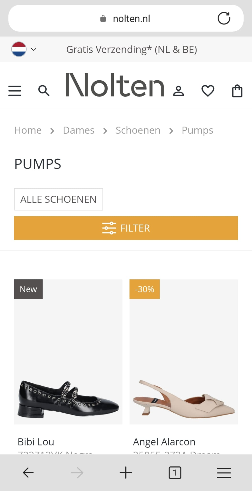

  #### Screenshot(s) van de tweede pagina (small screen):
  comfort <a>https://www.nolten.nl/di-lauro-romani-light-beige77-38-47597<a> 
  
 

## Toegankelijkheidstest 1/2 (week 1)

  
uitwerken na test in 2e werkgroep

  ### Bevindingen
  Lijst met je bevindingen die in de test naar voren kwamen:
  1.	Veel iconen en afbeeldingen op de site hebben geen beschrijvende alt-tekst. Wanneer een screenreader deze tegenkomt, wordt enkel "image" uitgesproken, zonder verdere context of uitleg over wat het voorstelt.
  2.	De HTML maakt veelvuldig gebruik van generieke elementen zoals div, span en class namen zonder goede reden/waarde. 
  3.	De toetsenbordnavigatie werkt grotendeels goed. Echter, op de overzichtspagina wordt bij elk product eerst de favoriet optie voorgelezen, in plaats van de productnaam. Dit kan verwarrend voor screenreadergebruikers.
  4.	De koppenstructuur is op de overzichtspagina in orde. Op de productpagina wordt echter direct naar een h3 gesprongen, zonder dat daar een logische hiërarchie aan voorafgaat.
  5.	De site maakt geen gebruik van semantische lijstelementen zoals ul, ol of li. Hierdoor is de inhoud voor screenreaders moeilijker te structureren en begrijpen.
  6.	Sommige afbeeldingen hebben wel een alt tekst, maar deze bevat enkel de productnaam en geen beschrijving van wat er daadwerkelijk op de afbeelding te zien is. 
  7.	Afbeeldingen met tekst bevatten vaak helemaal geen alt attribuut.
  8.	In sommige weergavemode (zoals dark mode) verdwijnen visuele elementen van de site, zoals productafbeeldingen. Dit komt doordat er gebruik wordt gemaakt van een "onzichtbare" achtergrondkleur, waardoor bijvoorbeeld zwarte schoenen op een zwarte achtergrond niet zichtbaar zijn.
  9.	De instelling "reduce motion" heeft geen effect (animaties blijven actief). Alhoewel het om een kleine animaties gaat.
  10.	De secundaire tekstkleur op de site is te licht en voldoet niet aan de WCAG-contrastvereisten. Dit maakt de tekst moeilijk leesbaar voor gebruikers die bv kleurenblind zijn.

## Breakdownschets (week 1)

  
uitwerken na afloop 3e werkgroep

  ### de hele pagina: 
  

  ### dynamisch deel (menu): 
  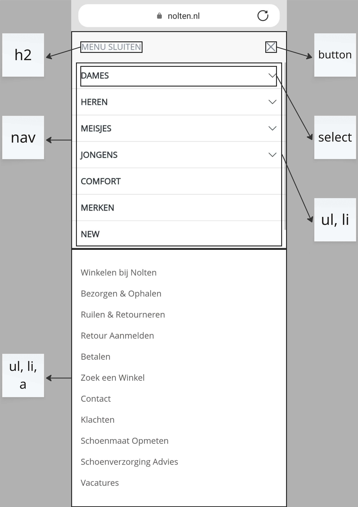

  ### wellicht nog een dynamisch deel (zoekbar): 
  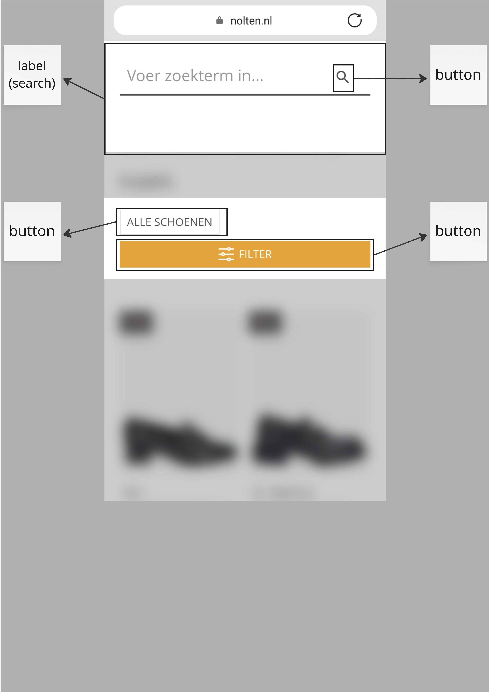

## Voortgang 1 (week 2)

  
uitwerken voor 1e voortgang

  ### Stand van zaken
  hier dit ging goed & dit was lastig (neem ook screenshots op van delen van je website en code)
  Ik loop nog achter met het schrijven van de code zelf, maar ik ben dit jaar wel sneller met de opdrachten in klas en bergijp ze ook beter.

  Code voortgang 1 head en header
  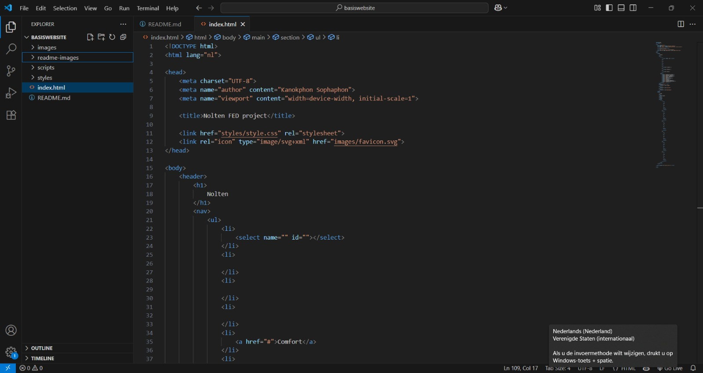

  Code voortgang 1 header
  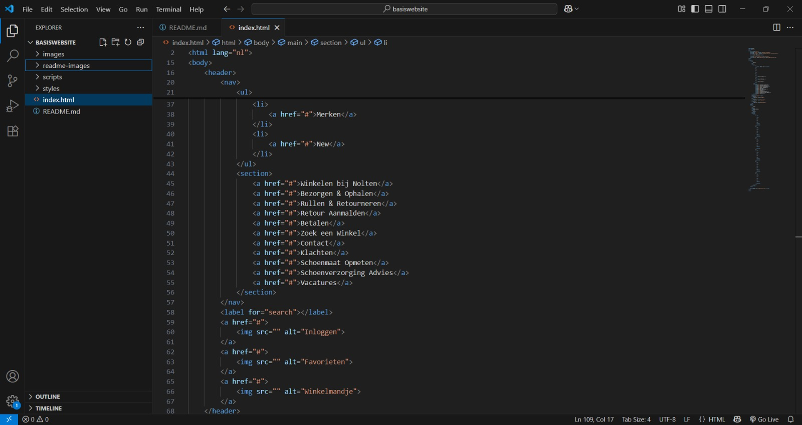

  Code voortgang 1 main
  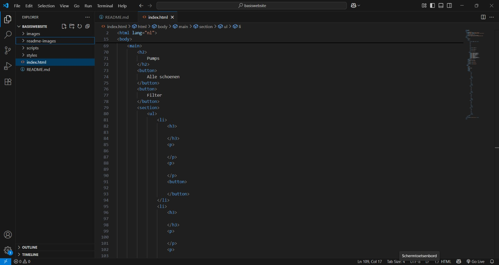

  ### Agenda voor meeting
  samen met je groepje opstellen

  | Kanokphon      | Samya          | Zineb    | Bener        |
  | ---            | ---                | ---          | ---              |
  | Mag je meerdere secties in de footer gebruiken?  | Kan ik in een section andere html elementen stoppen zonder een article om de section heen te zetten? | Hoe kun je iconen downloaden van de site? | Wanneer gebruik ik Ul en wanneer Ol?    |
  | Welk HTML element moet ik gebruiken voor de beoordeling onderaan de pagina (img)? | Moet je een section zetten om de header als er een img in zit en een link? | Er bestaat geen h1 op de homepage van Cowboy, ik heb er nu voor gekozen om een visually hidden h1 te kiezen voor de screenreader, maar eigenlijk zou er wel een zichtbare h1 moeten zijn. Dit kan niet Cruiser zijn of Go Dutch, want dan zou Cruiser ST of de andere slogan ook een h1 moeten zijn maar er is maar een h1 op een pagina. | ⁠Ik heb lang niet gecodeerd. Hoe onderscheid ik een parent en een child? En wat betekenden ze? |
  | Moet er in de head een header staan, of is dat niet nodig (moet ik een header hebben)?            | X                | Wanneer gebruik ik section en wanneer article? → Bijvoorbeeld bij de herhaalde productblokken (Cruiser, Cruiser ST).          | Op mijn website (lab111.nl) staat er op de homepage geen H1. Echter begint deze pagina met een grote logo. Mag deze als H1 worden gebruikt?              |
  | Moet ik bij de dynamisch deel zoekbar een extra section maken voor de filters?           | X                | Wanneer gebruik ik figure en figcaption, en wanneer alleen een img?          | X              |

  ### Verslag van meeting
  hier na afloop snel de uitkomsten van de meeting vastleggen

  - punt 1
  - punt 2
  - nog een punt
  - ...

## Voortgang 2 (week 3)

  
uitwerken voor 2e voortgang

  ### Stand van zaken
  Ik had niet goed in mijn agenda gezet wanneer de 2e voortgang is, dus loop nog steets er achter.

  HTML code voortgang 2
  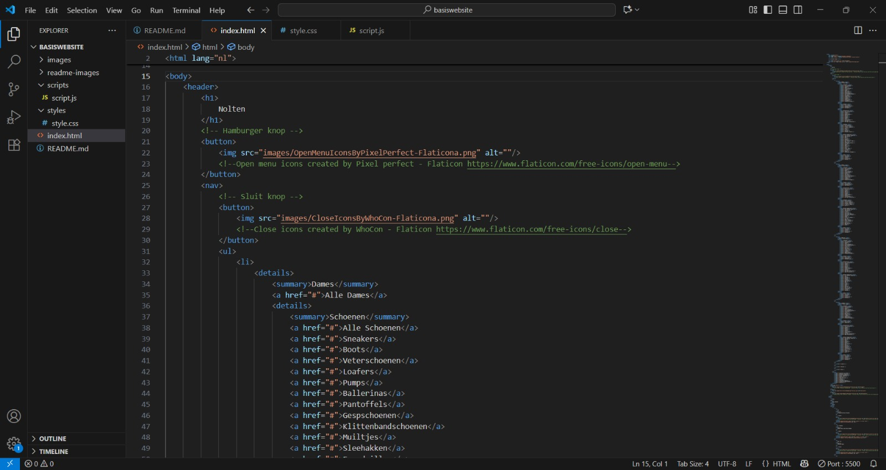

  CSS code voortgang 2
  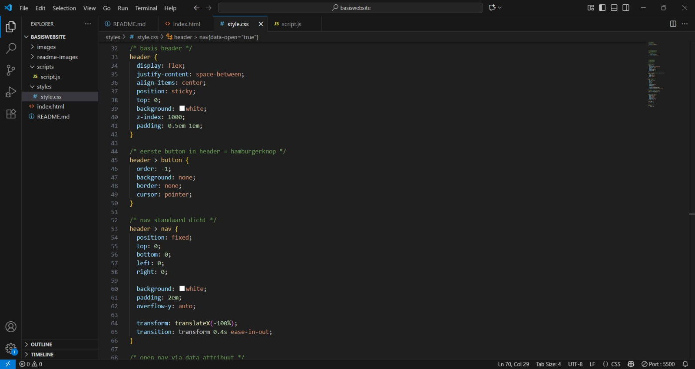

  JS code voortgang 2
  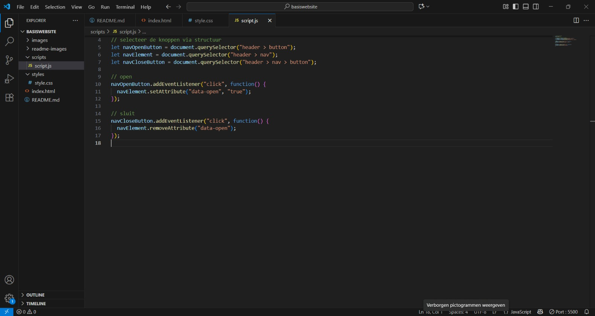

  Site voortgang 2
  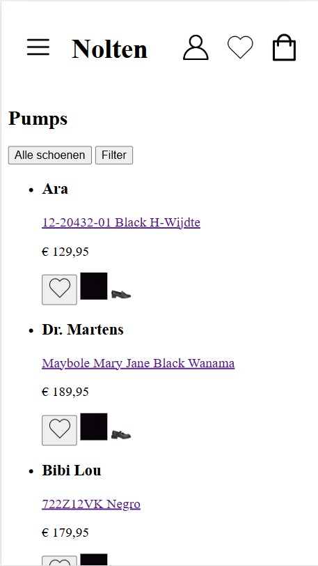
  
  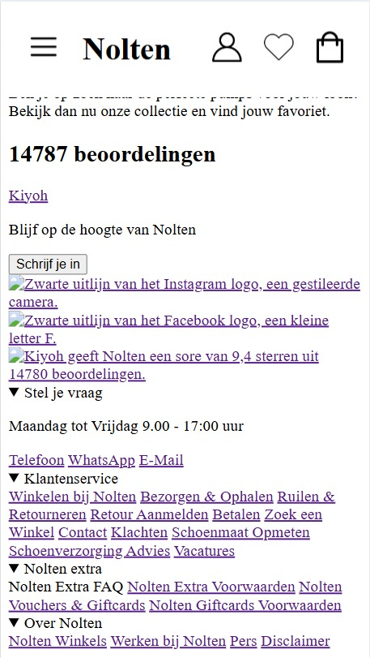
  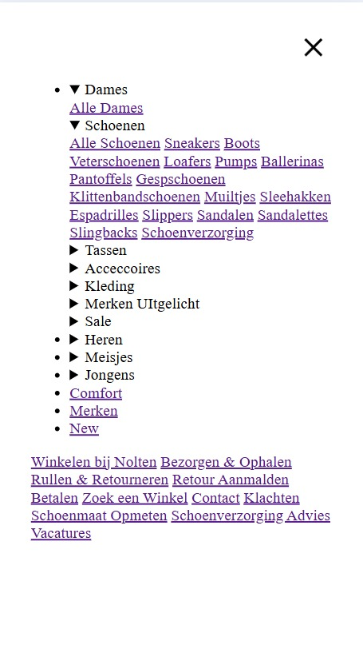

  ### Agenda voor meeting
  samen met je groepje opstellen

  | Kanokphon      | Samya          | Zineb    | Bener        |
  | ---            | ---                | ---          | ---              |
  | Waar kan ik gratis svg download?  | Kan ik dezelfde h3’s gebruiken in 1 lijstje?  | X    | Hoe overlap ik 2 foto’s op elkaar?    |
  | Mag ik andere inhoud in mijn code verwerken dan wat ik in mijn ReadMe staat? | Kan ik li’s gebruiken voor de content op mijn website ipv sections? Welke zou beter zijn? | X | Maak je een hamburger menu als icon? |
  | Kan ik ergens een "correct" tag volgorde van HTML en CSS vinden?            | Met welke html tag verberg ik de h1 op mijn website                | X          | Hoe plaats ik dingen op volgorde in HTML? (bijvoorbeeld de volgorde van de nav en hoe je dat moet nesten).          |
  | Als ik op zoeken druk, krijg ik niet alleen de zoekbalk maar ook filters  in een aparte sectie. Hoe laat ik dat ook verschijnen samen met de zoekbalk?            | Hoe kan ik de border radius aanpassen op 1 hoek van een css element?                | X          | Hebben we al gehad, maar hoe maak ik code responsive?          |
  | Hoe kan ik een 2e CSS koppelen?            | Hoe maak ik drop downs in een hamburger menu?                | X          | X          |

  ### Verslag van meeting
  hier na afloop snel de uitkomsten van de meeting vastleggen

  - De icon kan ik terug vinden bij Nolten, inspecteren, inspect, durk op icon, druk op 3 pinten links, editten in HTML, kopier de hele lijk en vermel er bij dat de svg van Not
  - punt 2
  - nog een punt
- ...

## Toegankelijkheidstest 2/2 (week 4)

  
uitwerken na test in 9e werkgroep

  ### Bevindingen
  Lijst met je bevindingen die in de test naar voren kwamen (geef ook aan wat er verbeterd is):

## Voortgang 3 (week 4)

  
uitwerken voor 3e voortgang

  ### Stand van zaken
  Ik loop nog steeds achter met mijn code. Ik heb te veel tijd besteed aan het uitzoeken waarom de kleuren in mijn CSS niet werkten. Ik denk dat het probleem in mijn :root-instellingen zit. Daarnaast heeft de achtergrond in CSS veel tijd gekost, omdat die niet doet wat ik wil. Ook kreeg ik de social media iconen niet netjes naast elkaar en het favorieten hartje bij de producten blijft steeds verschuiven. Wat wel goed gelukt is, is de carousel, maar dat is eigenlijk het enige.

  Root Probleem voortgang 3
  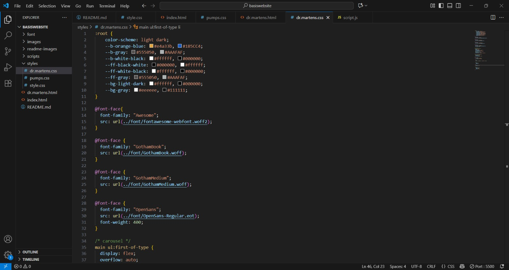

  Beoordelingen achtergrond en iconen voortgang 3
  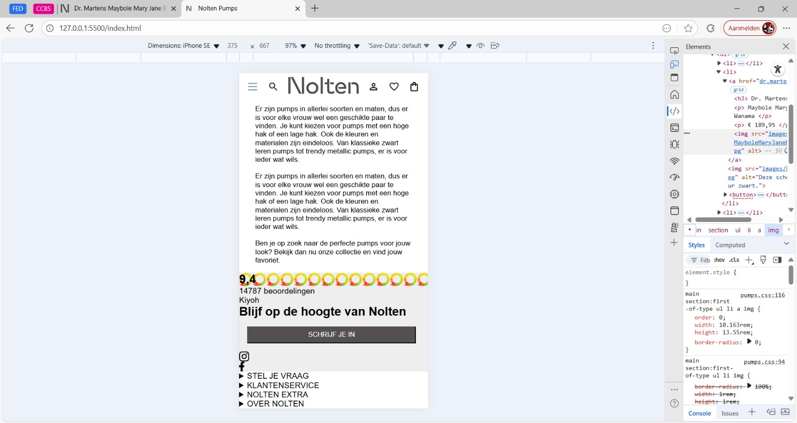

  Favourite button voortgang 3
  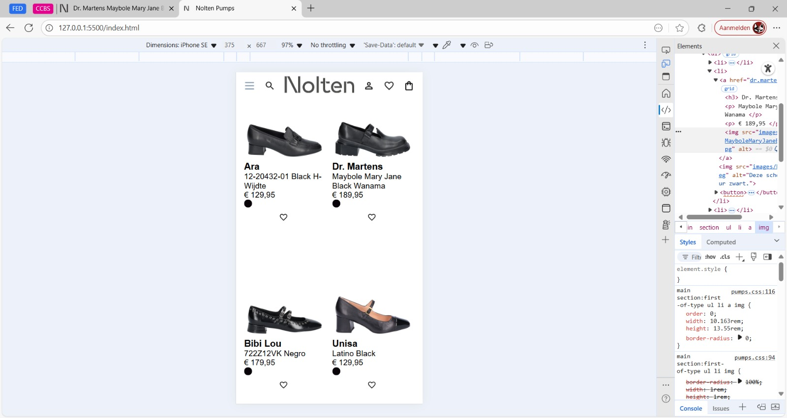

  Carousel CSS voortgang 3
  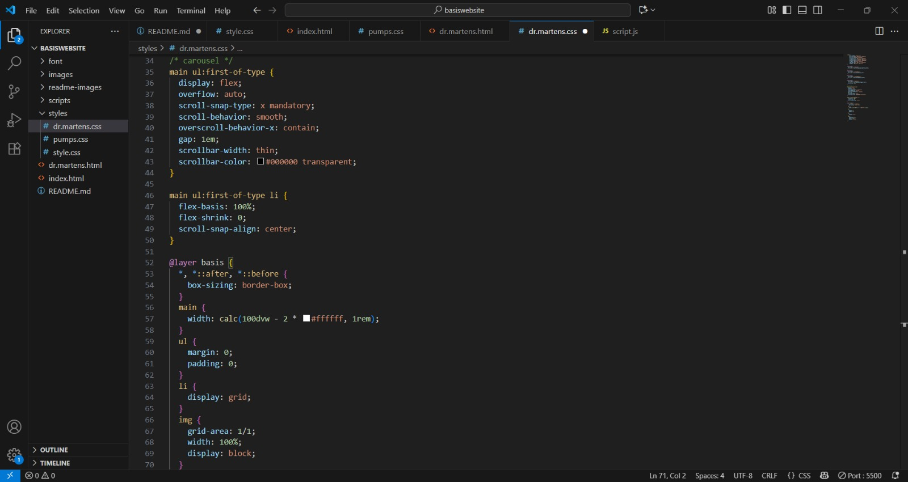

  ### Agenda voor meeting
  samen met je groepje opstellen

  | Kanokphon      | Samya          | Zineb    | Bener        |
  | ---            | ---                | ---          | ---              |
  | Wat heb ik gedaan dat mijn kleuren van mijn root niet toe gepassen kunnen worden?
  | Hoe zet ik iconen in de footer naast elkaar?             | Waarom zie ik niet alle html elementen van mijn footer?    | Hoe maak je ook alweer een foto carousel/slider? (Automatisch)    |
  | Hoe kan ik in 1x dark mode via root coderen? | ⁠Mijn sluit knop van de hamburger menu doet het niet, waar kan dat aan liggen? | Klopt mijn css hyrargie: common, index en testrit | dit wil ik zekerHoe maak ik hover animaties in die carousel? |
  | Moet ik elke button in mijn site werkend maken?           | ⁠hoe style ik foto’s in een bepaalde vorm?             | Hoe kan ik de kleur van mijn iconen aanpassen         | Hoe maak ik die blauwe lijntjes tussendoor mijn sections in mijn website?  (lab111.nl)              |
  | Hoe krijg ik 1 versie van de beoordeling afbeelding in css ipv deze afbeelding meerdere keren achter elkaar?           | X               | Ik heb in mijn navigatie a gebruikt ipv buttons. Kan ik dit in javascript makkelijk gebruiken, omdat het dus niet echt wordt gelinkt naar een pagina maar op de pagina blijft.          | Specials img of banner?              |
  | Hoe moet ik de favorieten hartje bij de producten aan spreken in css.?           | X               | X          | Hoe verstop ik de rest van tekst in mijn captions?              |
  | Hoe kan ik alleen de social media bij de beoordeling naast elkaar krijgen?           | X               | X         | Icoontjes in footer. Hover, linkjes, svg?             |
  | Hoeveel js moeten we hebben, 1 toch?          | X              | X         | X             |

  ### Verslag van meeting
  hier na afloop snel de uitkomsten van de meeting vastleggen

  - punt 1
  - punt 2
  - nog een punt
  - ...

## Eindgesprek (week 5)

  
uitwerken voor eindgesprek

  ### Je uitkomst - karakteristiek screenshots:
  

  ### Dit ging goed/Heb ik geleerd: 
  Korte omschrijving met plaatjes

  

  ### Dit was lastig/Is niet gelukt:
  Korte omschrijving met plaatjes

  

## Bronnenlijst

  
continu bijhouden terwijl je werkt

  Nb. Wees specifiek ('css-tricks' als bron is bijv. niet specifiek genoeg). 
  Nb. ChatGpT en andere AI horen er ook bij.
  Nb. Vermeld de bronnen ook in je code.

  1. bron 1
  2. bron 2
  3. ...

