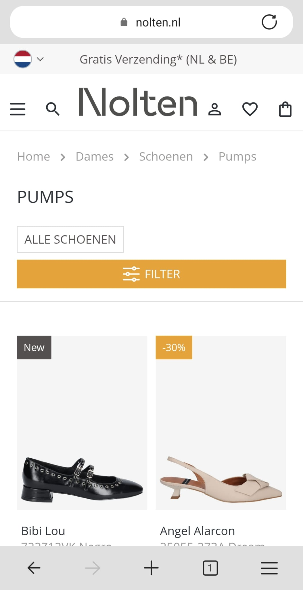
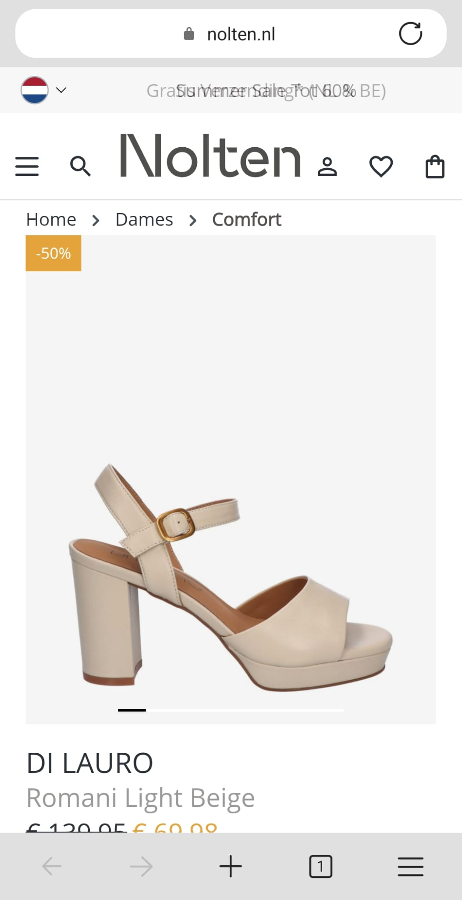
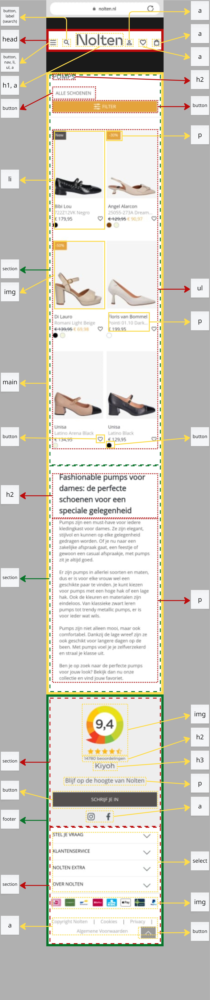

# Procesverslag
Markdown is een simpele manier om HTML te schrijven.  
Markdown cheat cheet: [Hulp bij het schrijven van Markdown](https://github.com/adam-p/markdown-here/wiki/Markdown-Cheatsheet).

Nb. De standaardstructuur en de spartaanse opmaak van de README.md zijn helemaal prima. Het gaat om de inhoud van je procesverslag. Besteedt de tijd voor pracht en praal aan je website.

Nb. Door *open* toe te voegen aan een *details* element kun je deze standaard open zetten. Fijn om dat steeds voor de relevante stuk(ken) te doen.

## Jij

  
uitwerken voor kick-off werkgroep

  ### Auteur:
  Kanokphon Sophaphon

  #### Je startniveau:
  blauw

  #### Je focus:
  surface plane
 

## Je website

  
uitwerken voor kick-off werkgroep

  ### Je opdracht:
  link naar de website <a>https://www.nolten.nl/<a> 

  #### Screenshot(s) van de eerste pagina (small screen): 
  pumps <a>https://www.nolten.nl/dames/schoenen/pumps/?p=1&properties=ba5ddb43c819f8b227a6eb6a88674c1f%7C92cc227532d17e56e07902b254dfad10<a>  
  

  #### Screenshot(s) van de tweede pagina (small screen):
  comfort <a>https://www.nolten.nl/di-lauro-romani-light-beige77-38-47597<a> 
  
 

## Toegankelijkheidstest 1/2 (week 1)

  
uitwerken na test in 2e werkgroep

  ### Bevindingen
  Lijst met je bevindingen die in de test naar voren kwamen:
  1.	Veel iconen en afbeeldingen op de site hebben geen beschrijvende alt-tekst. Wanneer een screenreader deze tegenkomt, wordt enkel "image" uitgesproken, zonder verdere context of uitleg over wat het voorstelt.
  2.	De HTML maakt veelvuldig gebruik van generieke elementen zoals div, span en class namen zonder goede reden/waarde. 
  3.	De toetsenbordnavigatie werkt grotendeels goed. Echter, op de overzichtspagina wordt bij elk product eerst de favoriet optie voorgelezen, in plaats van de productnaam. Dit kan verwarrend voor screenreadergebruikers.
  4.	De koppenstructuur is op de overzichtspagina in orde. Op de productpagina wordt echter direct naar een h3 gesprongen, zonder dat daar een logische hiërarchie aan voorafgaat.
  5.	De site maakt geen gebruik van semantische lijstelementen zoals ul, ol of li. Hierdoor is de inhoud voor screenreaders moeilijker te structureren en begrijpen.
  6.	Sommige afbeeldingen hebben wel een alt tekst, maar deze bevat enkel de productnaam en geen beschrijving van wat er daadwerkelijk op de afbeelding te zien is. 
  7.	Afbeeldingen met tekst bevatten vaak helemaal geen alt attribuut.
  8.	In sommige weergavemode (zoals dark mode) verdwijnen visuele elementen van de site, zoals productafbeeldingen. Dit komt doordat er gebruik wordt gemaakt van een "onzichtbare" achtergrondkleur, waardoor bijvoorbeeld zwarte schoenen op een zwarte achtergrond niet zichtbaar zijn.
  9.	De instelling "reduce motion" heeft geen effect (animaties blijven actief). Alhoewel het om een kleine animaties gaat.
  10.	De secundaire tekstkleur op de site is te licht en voldoet niet aan de WCAG-contrastvereisten. Dit maakt de tekst moeilijk leesbaar voor gebruikers die bv kleurenblind zijn.

## Breakdownschets (week 1)

  
uitwerken na afloop 3e werkgroep

  ### de hele pagina: 
  

  ### dynamisch deel (bijv menu): 
  

  ### wellicht nog een dynamisch deel (bijv filter): 
  

## Voortgang 1 (week 2)

  
uitwerken voor 1e voortgang

  ### Stand van zaken
  hier dit ging goed & dit was lastig (neem ook screenshots op van delen van je website en code)
  Ik loop nog achter met het schrijven van de code zelf, maar ik ben dit jaar wel sneller met de opdrachten in klas en bergijp ze ook beter.

  ### Agenda voor meeting
  samen met je groepje opstellen

  | Kanokphon      | student 2          | student 3    | student 4        |
  | ---            | ---                | ---          | ---              |
  | Mag je meerdere secties in de footer gebruiken?  | en dit             | en ik dit    | en dan ik dat    |
  | Welk HTML element moet ik gebruiken voor de beoordeling onderaan de pagina (img)? | dit als er tijd is | nog een punt | dit wil ik zeker |
  | Moet er in de head een header staan, of is dat niet nodig (moet ik een header hebben)?            | ...                | ...          | ...              |

  ### Verslag van meeting
  hier na afloop snel de uitkomsten van de meeting vastleggen

  - punt 1
  - punt 2
  - nog een punt
  - ...

## Voortgang 2 (week 3)

  
uitwerken voor 2e voortgang

  ### Stand van zaken
  hier dit ging goed & dit was lastig (neem ook screenshots op van delen van je website en code)

  ### Agenda voor meeting
  samen met je groepje opstellen

  | student 1      | student 2          | student 3    | student 4        |
  | ---            | ---                | ---          | ---              |
  | dit bespreken  | en dit             | en ik dit    | en dan ik dat    |
  | en dat ook nog | dit als er tijd is | nog een punt | dit wil ik zeker |
  | ...            | ...                | ...          | ...              |

  ### Verslag van meeting
  hier na afloop snel de uitkomsten van de meeting vastleggen

  - punt 1
  - punt 2
  - nog een punt
- ...

## Toegankelijkheidstest 2/2 (week 4)

  
uitwerken na test in 9e werkgroep

  ### Bevindingen
  Lijst met je bevindingen die in de test naar voren kwamen (geef ook aan wat er verbeterd is):

## Voortgang 3 (week 4)

  
uitwerken voor 3e voortgang

  ### Stand van zaken
  hier dit ging goed & dit was lastig (neem ook screenshots op van delen van je website en code)

  ### Agenda voor meeting
  samen met je groepje opstellen

  | student 1      | student 2          | student 3    | student 4        |
  | ---            | ---                | ---          | ---              |
  | dit bespreken  | en dit             | en ik dit    | en dan ik dat    |
  | en dat ook nog | dit als er tijd is | nog een punt | dit wil ik zeker |
  | ...            | ...                | ...          | ...              |

  ### Verslag van meeting
  hier na afloop snel de uitkomsten van de meeting vastleggen

  - punt 1
  - punt 2
  - nog een punt
  - ...

## Eindgesprek (week 5)

  
uitwerken voor eindgesprek

  ### Je uitkomst - karakteristiek screenshots:
  

  ### Dit ging goed/Heb ik geleerd: 
  Korte omschrijving met plaatjes

  

  ### Dit was lastig/Is niet gelukt:
  Korte omschrijving met plaatjes

  

## Bronnenlijst

  
continu bijhouden terwijl je werkt

  Nb. Wees specifiek ('css-tricks' als bron is bijv. niet specifiek genoeg). 
  Nb. ChatGpT en andere AI horen er ook bij.
  Nb. Vermeld de bronnen ook in je code.

  1. bron 1
  2. bron 2
  3. ...

